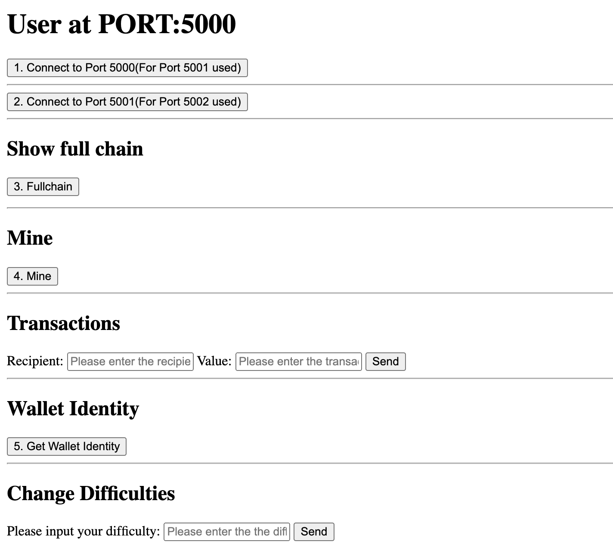

# Crypto

This is the project for EE4017 Internet Finance 



Python version: 3.9.12

Running device: Macbook Pro 2021 

## Cloning the repository

```bash
git clone https://github.com/andy145155/Cryptocurrency-Network.git
```

## Setup a virtual environment 
```bash
pip3 install virtualenv
virtualenv crypto
source crypto/bin/activate
```
## Installation

Use the package manager [pip3](https://pip.pypa.io/en/stable/) to install required dependency.

```bash
pip3 install pycryptodome
pip3 install flask
pip3 install requests
```

## Run

Open 3 Terminal tabs and run the following code in each terminal.

The 1st terminal window
```bash
source crypto/bin/activate
python3 main.py
```

The 2nd terminal window
```bash
source crypto/bin/activate
python3 main5001.py
```

The 3rd terminal window
```bash
source crypto/bin/activate
python3 main5002.py
```